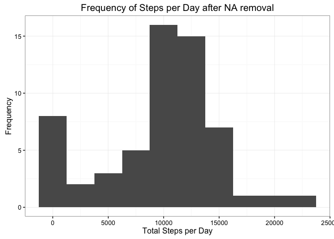
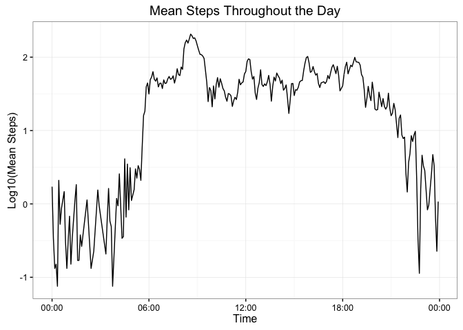
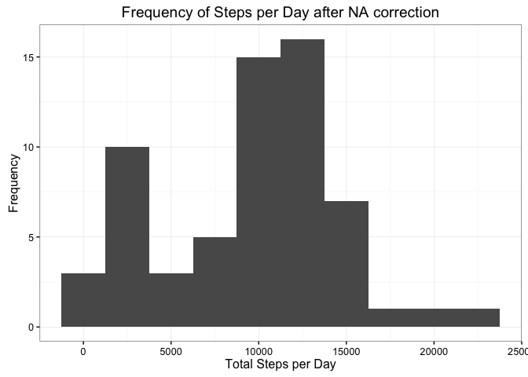
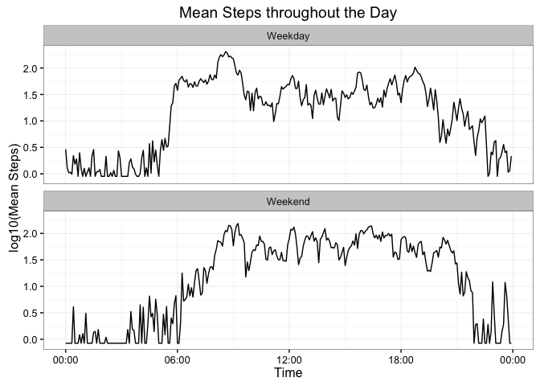

# Reproducible Research: Peer Assessment 1


## Loading and preprocessing the data
1. Load the data

```r
  library(data.table)
  library(ggplot2)
  library(dplyr)
```

```
## 
## Attaching package: 'dplyr'
```

```
## The following objects are masked from 'package:data.table':
## 
##     between, last
```

```
## The following objects are masked from 'package:stats':
## 
##     filter, lag
```

```
## The following objects are masked from 'package:base':
## 
##     intersect, setdiff, setequal, union
```

```r
  library(lubridate)
```

```
## 
## Attaching package: 'lubridate'
```

```
## The following objects are masked from 'package:data.table':
## 
##     hour, mday, month, quarter, wday, week, yday, year
```

```
## The following object is masked from 'package:base':
## 
##     date
```

```r
  library(stringr)
  library(chron)
```

```
## 
## Attaching package: 'chron'
```

```
## The following objects are masked from 'package:lubridate':
## 
##     days, hours, minutes, seconds, years
```

```r
  unzip("activity.zip")
  inData = read.csv("activity.csv")
```

2. Process and Transform the data

```r
  #convert the interval number to a time
  inData$interval = str_pad(inData$interval,4, side = "left",pad = "0")
  inData$date = parse_date_time(paste0(inData$date,inData$interval), "ymd hm")
```

## What is mean total number of steps taken per day?

```r
#cut by day - remove na, and summarize
by_day = inData %>%
        mutate(
          dayfactor = strftime(date,format = "%Y%m%d")
        )   %>%
        group_by(dayfactor)  %>%
        filter(!is.na(steps)) %>%
        summarise(sum(steps, na.rm = TRUE))
        colnames(by_day) = c("day","sum")
#plot output
ggplot(by_day,aes(sum)) + geom_histogram(binwidth = 2500)  + theme_bw() + xlab("Total Steps per Day") + 
  ylab("Frequency") + ggtitle("Frequency of Steps per Day after NA removal")
```

<!-- -->

```r
paste("Mean steps:",mean(by_day$sum,na.rm = TRUE),"Median steps:",median(by_day$sum,na.rm = TRUE))
```

```
## [1] "Mean steps: 9671.3220338983 Median steps: 10439"
```


## What is the average daily activity pattern?

```r
#regroup data by interval
by_interval = inData %>%
        group_by(interval)  %>%
        filter(!is.na(steps)) %>%
        summarise(mean = mean(steps, na.rm = TRUE)) %>%
        filter(mean!=0) %>%
        mutate(interval = parse_date_time(interval, "hm"))

ggplot(by_interval, aes(x = as.POSIXct(interval),y = log10(mean))) + geom_line() +
  scale_x_datetime(date_labels = "%H:%M") + xlab("Time") + ylab("Log10(Mean Steps)") + theme_bw() + 
  ggtitle("Mean Steps Throughout the Day")
```

<!-- -->

```r
paste("Maximum average number of steps were taken at:",
      format(by_interval$interval[which(by_interval$mean==max(by_interval$mean))],"%H:%M"))
```

```
## [1] "Maximum average number of steps were taken at: 08:35"
```


## Imputing missing values

```r
paste("There are",length(which(is.na(inData$steps))),"NA values in the dataset.")
```

```
## [1] "There are 2304 NA values in the dataset."
```

```r
#calculate the mean values for each day
daily_means = inData %>%
  mutate(dayfactor = as.factor(strftime(date,format = "%Y%m%d", tz = "GMT"))) %>%
  group_by(dayfactor) %>%
  summarize(mean = mean(steps,na.rm = TRUE)) 
#replace each daily mean with an approximated value
daily_means$mean = replace(daily_means$mean,which(is.nan(daily_means$mean)),mean(by_day$sum,na.rm = TRUE)/1440)

fix_missing = function(x){
  #print(paste("x[1]:",x[1],"x[4]",x[4]))
  if(is.na(x[1])){
    #print(paste("found mean at position",which(daily_means$dayfactor==x[4])))
    x[1] = daily_means[which(daily_means$dayfactor==x[4]),2]
    #print(paste("x was NA, now",x[1]))
  }
  x[1]
}

corrected = inData %>%
  mutate(day = as.factor(strftime(date,format = "%Y%m%d", tz = "GMT"))) %>%
  apply(1,fix_missing)  %>%
  unlist() %>%
  as.numeric() %>%
  as.matrix(ncol=1)

corrected = cbind(steps = corrected,inData[,2:3])

test_by_day = corrected %>%
        mutate(
          dayfactor = strftime(date,format = "%Y%m%d")
        )   %>%
        group_by(dayfactor)  %>%
        summarise(sum(steps))
colnames(test_by_day) = c("day","sum")

#combine to make an overlayed plot

#plot output
ggplot(test_by_day,aes(sum)) + geom_histogram(binwidth = 2500)  + theme_bw() + xlab("Total Steps per Day") +
  ylab("Frequency") + ggtitle("Frequency of Steps per Day after NA correction")
```

<!-- -->

```r
paste("Mean steps:",mean(test_by_day$sum,na.rm = TRUE),"Median steps:",median(test_by_day$sum,na.rm = TRUE))
```

```
## [1] "Mean steps: 9452.93734281028 Median steps: 10311"
```
Though there are small effects throughout the histogram, the primary effect of replacing missing values (NA) is seen in the total steps equal to zero bin. 


## Are there differences in activity patterns between weekdays and weekends?

```r
  corrected_summary = corrected %>%
    mutate(weekday = factor(is.weekend(date), labels = c("Weekday","Weekend"))) %>%
        mutate(interval = parse_date_time(interval, "hm"))%>%
    group_by(interval, weekday) %>%
    summarise(mean = mean(steps, na.rm = TRUE))

ggplot(corrected_summary, aes(x = as.POSIXct(interval),y = log10(mean))) + geom_line() +
  scale_x_datetime(date_labels = "%H:%M") + xlab("Time") + ylab("log10(Mean Steps)") + theme_bw() + 
  ggtitle("Mean Steps throughout the Day") + facet_wrap(~weekday,ncol=1)
```

<!-- -->
